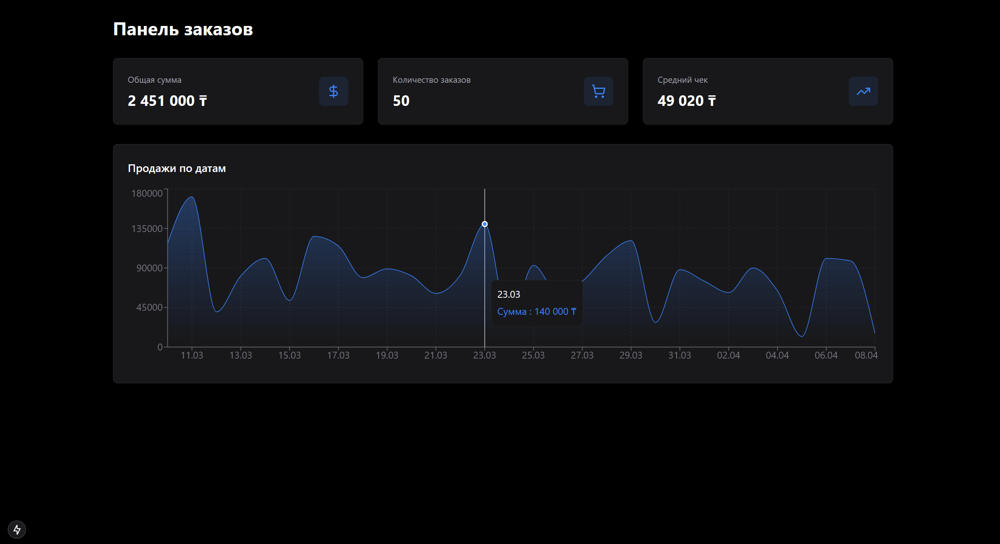
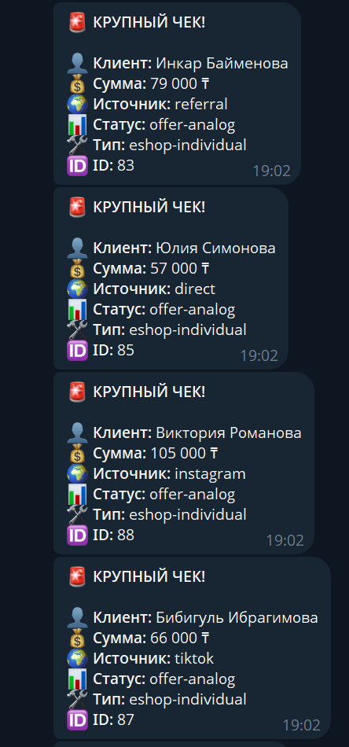

# Order Dashboard - Панель управления заказами

Полнофункциональная система управления заказами с интеграцией RetailCRM, Supabase и Telegram уведомлениями.

### Dashboard


### Telegram Notifications


## 🚀 Стек технологий

- **Frontend:** Next.js 15.1.0 (App Router), React 18.3.1, TypeScript 5.3.3
- **Styling:** Tailwind CSS 3.4.1
- **Database:** Supabase (PostgreSQL)
- **CRM:** RetailCRM API v5
- **Charts:** Recharts 2.10.3
- **Icons:** Lucide React 0.294.0
- **Notifications:** Telegram Bot API

## 📋 Возможности

- ✅ Загрузка заказов в RetailCRM
- ✅ Синхронизация данных с Supabase
- ✅ Интерактивный дашборд с метриками и графиками
- ✅ Telegram уведомления о крупных заказах (> 50,000 ₸)
- ✅ Отслеживание источников трафика (UTM)
- ✅ Темная минималистичная тема

## 🛠 Установка

### 1. Клонирование и установка зависимостей

```bash
npm install
```

### 2. Настройка переменных окружения

Создайте файл `.env` в корне проекта на основе `.env.example`:

```env
RETAILCRM_URL=https://your-domain.retailcrm.ru/
RETAILCRM_API_KEY=your_api_key_here
SUPABASE_URL=https://your-project.supabase.co
SUPABASE_ANON_KEY=your_supabase_anon_key_here
TELEGRAM_BOT_TOKEN=your_telegram_bot_token_here
TELEGRAM_CHAT_ID=your_telegram_chat_id_here
```

### 3. Настройка базы данных Supabase

Выполните SQL из файла `supabase_schema.sql` в Supabase SQL Editor:

```sql
CREATE TABLE orders (
  id BIGSERIAL PRIMARY KEY,
  external_id TEXT UNIQUE NOT NULL,
  amount NUMERIC(10, 2) DEFAULT 0,
  status TEXT DEFAULT 'new',
  customer_name TEXT,
  utm_source TEXT,
  order_type TEXT,
  created_at TIMESTAMPTZ DEFAULT NOW()
);
```

## 📦 Команды

### Разработка

```bash
npm run dev
```
Запускает Next.js сервер на http://localhost:3000

### Скрипты интеграции

```bash
npm run upload
```
Загружает заказы из `mock_orders.json` в RetailCRM

```bash
npm run sync
```
Синхронизирует заказы из RetailCRM в Supabase (с проверкой дубликатов)

```bash
npm run randomize
```
Распределяет даты заказов за последние 30 дней для реалистичной визуализации

```bash
npm run update-fields
```
Обновляет utm_source и order_type в Supabase из mock_orders.json

```bash
npm run notify
```
Отправляет Telegram уведомления о крупных заказах (> 50,000 ₸)

### Production

```bash
npm run build
npm run start
```

## 📊 Структура проекта

```
project41/
├── app/
│   ├── components/
│   │   ├── MetricCard.tsx      # Карточки метрик
│   │   └── SalesChart.tsx      # График продаж
│   ├── layout.tsx              # Корневой layout
│   ├── page.tsx                # Главная страница
│   └── globals.css             # Глобальные стили
├── lib/
│   └── supabase.ts             # Supabase клиент
├── scripts/
│   ├── upload_to_crm.js        # Загрузка в RetailCRM
│   ├── sync_to_supabase.js     # Синхронизация с Supabase
│   ├── randomize_dates.js      # Распределение дат
│   ├── update_supabase_fields.js # Обновление полей
│   └── telegram_bot.js         # Telegram уведомления
├── mock_orders.json            # Тестовые данные заказов
├── supabase_schema.sql         # SQL схема базы данных
├── Development_Log.md          # Лог разработки
└── .env.example                # Шаблон переменных окружения
```

## 🎨 Дизайн

Дашборд выполнен в стиле **Minimalist Professional Dark**:
- Черный фон (#000)
- Карточки zinc-900 с синими акцентами
- Адаптивная сетка (responsive grid)
- Интерактивные графики с градиентами

## 📱 Telegram уведомления

Формат сообщения:
```
🚨 КРУПНЫЙ ЧЕК!
👤 Клиент: Имя Фамилия
💰 Сумма: 56,000 ₸
🌍 Источник: instagram
📊 Статус: new
🛠 Тип: eshop-individual
🆔 ID: 43
```

## 📝 Development Log

Файл `Development_Log.md` содержит подробную историю разработки проекта:
- Решенные проблемы и их причины
- Технические решения
- Изменения в архитектуре
- Даунгрейд на LTS стек для стабильности

Этот лог помогает понять эволюцию проекта и причины принятых решений.

## 🔒 Безопасность

- ✅ Все API ключи хранятся в `.env`
- ✅ `.env` добавлен в `.gitignore`
- ✅ Используется `process.env` для доступа к секретам
- ✅ Создан `.env.example` для документации

## 📈 Метрики дашборда

- **Общая сумма** - сумма всех заказов
- **Количество заказов** - общее количество
- **Средний чек** - средняя сумма заказа
- **График продаж** - динамика по датам за 30 дней

## 🤝 Интеграции

### RetailCRM
- Создание заказов через API v5
- Получение списка заказов
- Поддержка customFields (utm_source)

### Supabase
- PostgreSQL база данных
- Real-time возможности
- Проверка дубликатов по external_id

### Telegram
- Автоматические уведомления
- Markdown форматирование
- Фильтрация по сумме заказа

**Дата создания:** 09.04.2026  
**Версия:** 1.0.0
